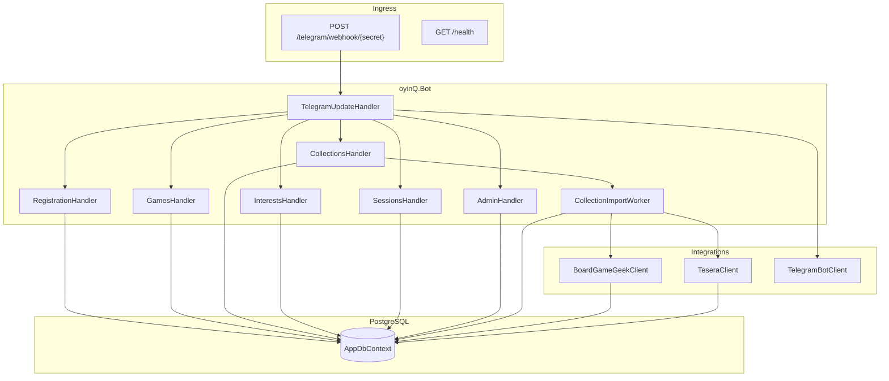
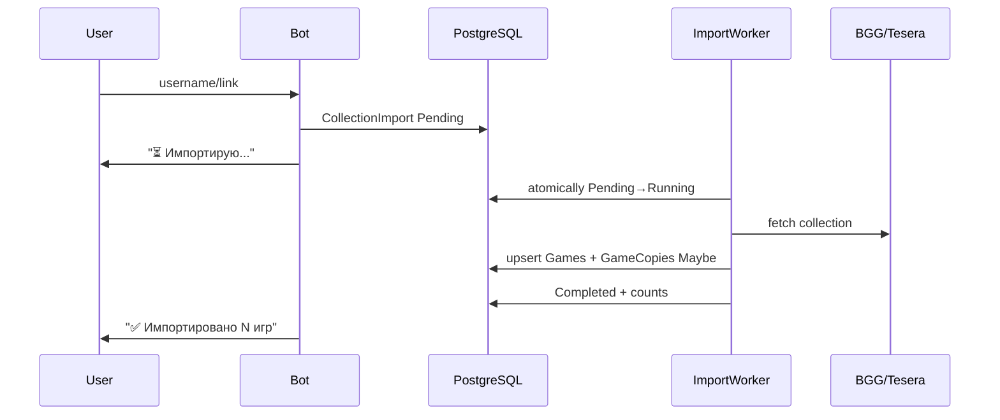

# BoardCamp Telegram Bot MVP

## Текущее состояние

Репозиторий `[C:\Users\Sardar\source\repos\oyinQ.Bot](C:\Users\Sardar\source\repos\oyinQ.Bot)` — пустой ASP.NET Core 10 Web API scaffold (WeatherForecast sample). Имя проекта **оставляем `oyinQ.Bot`**. **Apps Script reference получен** — логика BGG/Tesera/импорта переносится в C# по таблице ниже; Sheets/Forms части **не переносятся**.

**Codegraph:** в проекте есть [`.codegraph/`](C:\Users\Sardar\source\repos\oyinQ.Bot\.codegraph/). При реализации использовать MCP `codegraph_explore` с `projectPath: "C:\\Users\\Sardar\\source\\repos\\oyinQ.Bot"` — **до правок** и при отладке flows (dispatcher → handler → service → DbContext). Индекс обновляет пользователь (`codegraph init` / re-index после крупных изменений); агент сам индекс не запускает.

## Codegraph — workflow при реализации

| Когда | Query пример |
|-------|--------------|
| Phase 1 — перед wiring DI | `Program.cs AppDbContext TelegramUpdateHandler` |
| Phase 2 — registration flow | `RegistrationHandler Participant ConversationState` |
| Phase 3 — game dedup/interest | `GameDedupService GameInterest GamesHandler` |
| Phase 4 — import pipeline | `CollectionImportWorker BoardGameGeekClient TeseraClient` |
| Phase 5 — sessions | `SessionsHandler GameSession edit message` |
| Phase 6 — admin/export | `AdminHandler CsvExportService` |
| После каждой фазы | blast-radius query по изменённым handler/service |

**Правила:**
- `codegraph_explore` — primary tool для «как это связано»; не дублировать Read по файлам, уже показанным в ответе
- Grep/Read — только если символ ещё не в индексе (ранние фазы до re-index) или для конфигов/README
- После Phase 1 и Phase 4 (крупные structural changes) — напомнить пользователю re-index, если explore не находит новые символы

## Целевая архитектура




## Структура проекта

Переименовать/удалить WeatherForecast sample, добавить feature-oriented layout:

```text
oyinQ.Bot/
├── Features/
│   ├── Registration/     RegistrationHandler, RegistrationMessages
│   ├── Games/            GamesHandler, GameSearchService, GameDedupService
│   ├── Collections/      CollectionsHandler, CollectionImportWorker
│   ├── Interests/        InterestsHandler
│   ├── Sessions/         SessionsHandler, SessionMessageFormatter
│   └── Admin/            AdminHandler, CsvExportService
├── Integrations/
│   ├── Telegram/         TelegramUpdateHandler, CallbackData, Keyboards
│   ├── BoardGameGeek/    IBoardGameGeekClient, BoardGameGeekClient, parsers
│   └── Tesera/           ITeseraClient, TeseraClient, parsers
├── Data/
│   ├── AppDbContext.cs
│   ├── Entities/         7 core + 2 support entities
│   └── Migrations/
├── Common/
│   ├── Options/          BotOptions, BggOptions, CampOptions
│   ├── Normalization/    GameNameNormalizer
│   └── Extensions/
├── Program.cs
├── Dockerfile            (обновить)
└── README.md

oyinQ.Bot.Tests/          unit tests для pure logic
```

## NuGet-зависимости

Добавить в `[oyinQ.Bot.csproj](oyinQ.Bot.csproj)`:


| Package                                                                   | Назначение                    |
| ------------------------------------------------------------------------- | ----------------------------- |
| `Telegram.Bot`                                                            | Bot API                       |
| `Microsoft.EntityFrameworkCore` + `Npgsql.EntityFrameworkCore.PostgreSQL` | ORM + PostgreSQL              |
| `Microsoft.EntityFrameworkCore.Design`                                    | migrations                    |
| `Microsoft.Extensions.Http`                                               | typed HttpClient (BGG/Tesera) |


Test project: `xunit`, `Microsoft.NET.Test.Sdk`.

## Модель данных (EF Core)

7 основных сущностей + 2 вспомогательных:

```csharp
// Data/Entities/
Participant          // TelegramUserId UNIQUE
Game                 // BggId, TeseraAlias, NormalizedName indexes
GameCopy             // UNIQUE (GameId, OwnerParticipantId) для personal
GameInterest         // UNIQUE (ParticipantId, GameId)
GameSession          // TelegramChatId + TelegramMessageId для edit
GameSessionParticipant // UNIQUE (GameSessionId, ParticipantId)
CollectionImport     // async import queue
ParticipantConversationState // DB-backed wizard state, TTL 30 min
```

**Enums:** `GameCopySource` (Personal/Club), `BringStatus` (Bringing/Maybe), `SessionStatus` (Recruiting/Full/Closed), `ImportStatus`, `ImportTarget`, `ExternalGameProvider`.

**Dedup-логика** в `GameDedupService`:

1. Match by `BggId` → 2. `TeseraAlias` → 3. `NormalizedName`
2. Создать `GameCopy` per owner; club copies: `OwnerParticipantId = null`, `Source = Club`

**Idempotency:** unique constraints вместо `ProcessedTelegramUpdate` где возможно; для interest/join/session — natural uniqueness.

## Apps Script → C# Mapping (reference)

Что **переносим** из Apps Script и куда:

| Apps Script | C# target | Примечание |
|-------------|-----------|------------|
| `parseBGGUsernameFromInput` | `BggUsernameParser.Parse` | plain username; `/user/x`; `/collection/user/x`; `?username=` |
| `parseTeseraAliasFromInput` | `TeseraAliasParser.Parse` | decode URI; `/user/x`; `/users/x`; plain alias |
| `normTitle_` | `GameNameNormalizer` | Apps Script: `trim().toLowerCase()` — для dedup priority 3 расширить (strip punctuation) по спецификации |
| `httpGet` + retries | `HttpRetryHelper` | 3 retries, 1500ms + jitter; HTTP 202 → retry |
| `importFromBGGByUsernameStep_` | `BoardGameGeekClient` + worker step | см. BGG детали ниже |
| `bggFetchThingsInBatches_` | `BoardGameGeekClient.FetchThingsBatchAsync` | chunk=100, 120ms delay, 2 attempts per batch |
| `computeBestFromPollXml_` | `BggBestPlayerCalculator` | poll `suggested_numplayers`: Best ≥ Recommended ≥ Not Recommended; collapse ranges |
| `getBGGThingInfo` | `GetGameAsync(bggId)` | single-game add по ссылке `/boardgame/{id}` |
| `teseraFetchOwnSelfGamePaged_` | `TeseraClient.GetOwnedCollectionAsync` | 4 base URLs, pagination Limit=100 |
| `teseraFetchGameDetailsByAliases_` | `TeseraClient.FetchGameDetailsBatchAsync` | batch=12, 120ms delay, retry failed individually |
| `importFromTeseraCollectionByAlias` | worker Tesera branch | filter `isAddition=false`; SelfGame only |
| `enqueueImportTask_` | `CollectionImport` insert | dedup queued/running; optional refresh after 2 days |
| `importWorker_` | `CollectionImportWorker` | см. worker semantics ниже |
| `_autoResetRunningOlderThan(10)` | worker startup tick | Running >10 min → Pending |
| `mergeOwners_` + `SIGNUP_DELIM` | **не переносим** | заменено на `Game` + `GameCopy` per owner |
| `upsertGame` by title+owners string | `GameDedupService` | BggId → TeseraAlias → NormalizedName |
| `replaceUserSignups` / Sheets signups | `GameInterest` table | relational, не delimited string |
| `recalcDemandStatuses` / cell colors | SQL aggregate queries | без UI-раскраски |
| Forms, `onUnifiedSubmit`, Sheets | Telegram handlers | полностью заменено |

### BGG — точные параметры из Apps Script

```
GET /xmlapi2/collection?username={u}&own=1&excludesubtype=boardgameexpansion&stats=1
GET /xmlapi2/thing?id={ids}&stats=1          // batch до 100 id
GET /xmlapi2/thing?id={id}&stats=1           // single game
```

- **Auth (новое vs Apps Script):** добавить `Authorization: Bearer {BGG_API_TOKEN}` — Apps Script работал без token, но актуальный API требует registration
- **HTTP 202:** retry с `Task.Delay(1500)` до 3–5 попыток
- **Пагинация импорта:** Apps Script режет уже загруженный collection slice по offset, **limit=140** за tick; progress хранить в `CollectionImport.ProgressJson`: `{"offset":0,"total":N}`
- **Min/Max:** из collection `stats` attributes; **Best:** из thing poll (batch enrichment)
- **Skip duplicate:** если у participant уже есть `GameCopy` для этой `Game` — не создавать повторно (аналог `exists?.owners.has(ownerNick)`)

### Tesera — точные endpoints из Apps Script

Пробовать base URLs по порядку (первый с результатом wins):

```
https://api.tesera.ru/collections/base/own/{username}
https://api.tesera.ru/collections/base/Own/{username}
https://api.tesera.ru/collections/own/{username}
https://api.tesera.ru/collections/Own/{username}
?GamesType=SelfGame&Limit=100&Offset={offset}
```

Game details:

```
GET https://api.tesera.ru/games/{alias}   // batch 12 parallel, Accept: application/json
```

- Response shape: `game` / `Game` / root object — tolerant parsing
- Filter expansions: `isAddition === false || undefined`
- **Best players:** `playersMinRecommend`–`playersMaxRecommend` (если равны — одно число)
- **ExternalId:** alias; **Url:** `https://tesera.ru/game/{alias}`
- Tesera single-game link add был **отключён** в Apps Script — в боте делаем через search (спецификация), не через `/game/` URL

### Import worker semantics (из `importWorker_`)

| Constant | Value | C# equivalent |
|----------|-------|---------------|
| `IMPORT_MAX_PER_TICK` | 30 | max queue items processed per worker loop |
| `IMPORT_TIME_SOFT_MS` | 5 min | max duration одного worker pass |
| `IMPORT_NEXT_DELAY_MS` | 2000 | poll interval BackgroundService ≈ 5s (достаточно) |
| Stuck reset | 10 min | Running → Pending |
| BGG step size | 140 games/tick | один step per queue item per pass |
| Tesera | single pass | весь import за один Running cycle |

**CollectionImport fields (уточнение):**

```csharp
ProgressJson   // BGG: {"offset":140,"total":500}; Tesera: null
AddedCount     // games added this import
SkippedCount   // already existed
Error          // user-facing reason
Target         // Participant | Club
ExternalUsername
Provider       // Bgg | Tesera
```

**Re-import dedup (из `enqueueImportTask_`):** не ставить новый import если есть Completed за последние 2 дня для того же (Provider, ExternalUsername, Participant) — configurable, default 2 days.

**Post-import defaults:** personal copies → `BringStatus = Maybe`; club → `Source = Club`, `BringStatus = Bringing`.

## Конфигурация (Options pattern)

```text
TELEGRAM_BOT_TOKEN
TELEGRAM_WEBHOOK_SECRET
PUBLIC_BASE_URL
CONNECTION_STRING
BOARD_CAMP_CHAT_ID
ADMIN_TELEGRAM_IDS          // comma-separated
ACCOMMODATION_PRICE_PER_DAY // default 3000
BGG_API_TOKEN               // Bearer, обязателен с 2025+
USE_LONG_POLLING            // dev only, default false
PORT                        // cloud hosting
```

Классы: `BotOptions`, `CampOptions`, `BggOptions` в `Common/Options/`.

## Phase 1 — Foundation (≈2ч)

**Удалить:** `[Controllers/WeatherForecastController.cs](Controllers/WeatherForecastController.cs)`, `[WeatherForecast.cs](WeatherForecast.cs)`.

**Program.cs** — заменить на minimal hosting:

- `AddDbContext<AppDbContext>` с Npgsql
- `AddHttpClient<BoardGameGeekClient>` / `TeseraClient`
- `AddSingleton<ITelegramBotClient>` (factory from token)
- `AddHostedService<TelegramWebhookSetupService>` (prod) или `TelegramPollingService` (dev if `USE_LONG_POLLING=true`)
- `AddHostedService<CollectionImportWorker>`
- `AddScoped<TelegramUpdateHandler>` + feature handlers
- `await db.Database.MigrateAsync()` на startup
- `MapGet("/health", () => Results.Ok())`
- `MapPost("/telegram/webhook/{secret}", ...)` — validate secret, deserialize `Update`, dispatch

**Telegram dispatcher** (`[Integrations/Telegram/TelegramUpdateHandler.cs](Integrations/Telegram/TelegramUpdateHandler.cs)`):

1. Resolve `Participant` by `update.From.Id` (create stub only on `/start`)
2. Check `ParticipantConversationState` (expired if >30 min)
3. Route: commands → callbacks (prefix `game:`, `interest:`, `copy:`, `session:`, `reg:`, `admin:`) → free text (state machine)
4. Always `AnswerCallbackQuery` first on callbacks

**Dockerfile** — обновить: `ENV ASPNETCORE_URLS=http://+:${PORT:-8080}`, убрать лишний EXPOSE 8081, non-root user.

**Initial migration** — все entities + indexes.

## Phase 2 — Registration (≈1ч)

`[Features/Registration/RegistrationHandler.cs](Features/Registration/RegistrationHandler.cs)`:


| Step                | UX                                            |
| ------------------- | --------------------------------------------- |
| `/start` (new)      | inline: 1/2/3 дня                             |
| days chosen         | inline: жильё Да/Нет (3 000 ₸/день из config) |
| done                | «✅ Готово» + reply keyboard главного меню     |
| `/start` (existing) | сразу главное меню                            |


**Reply keyboard (главное меню):**
`🎲 Игры` | `➕ Добавить игры` | `🔥 Хочу сыграть` | `▶️ Собрать игру` | `👤 Моё`

Fallback commands: `/start`, `/menu`.

**👤 Моё** — профиль + кнопки «Изменить регистрацию», «Мои игры», «Мои хотелки». Изменение только `DaysStaying` и `NeedsAccommodation`.

## Phase 3 — Games + Interest (≈2.5ч)

### Каталог (`🎲 Игры`)

Inline sub-menu: Популярные / Точно будут / Возможно / Поиск.

- Показывать: club + personal `Bringing` + personal `Maybe`
- Пагинация через «Ещё» (по 10)
- Карточка игры: players, best, interest count, copies с emoji статуса, toggle interest

### Interest toggle

`GameInterest` insert/delete; callback `interest:toggle:{gameId}`; idempotent.

### 🔥 Хочу сыграть

Top-N по count `GameInterest`; кнопки «Мои хотелки», «Ещё»; tap → карточка.

### ➕ Добавить игры → одна игра

Conversation state `AwaitingGameSearch` → search BGG `/xmlapi2/search` → top 5 inline → `Bringing`/`Maybe`.

**Fallback из Apps Script (`addGameByLinkOrName`):** если пользователь прислал BGG URL `/boardgame/{id}` — напрямую `GetGameAsync(id)` без search (Tesera single URL — не поддерживать, как в Apps Script).

### Мои игры

Sub-screens: Самые востребованные / Возьму / Возможно / Поиск.
Quick action: `Maybe → Bringing` с подтверждением.

**Services:**

- `GameSearchService` — orchestrates BGG search (+ Tesera if available)
- `GameDedupService` — find-or-create Game + GameCopy
- `GameNameNormalizer` — lowercase, strip punctuation, collapse whitespace

## Phase 4 — Imports (≈2.5ч)

> **Reference:** Apps Script (получен) — реализовать по таблице mapping выше.

### BGG Client ([`Integrations/BoardGameGeek/`](Integrations/BoardGameGeek/))

```csharp
Task<IReadOnlyList<ExternalGame>> GetOwnedCollectionAsync(string username, CT);  // full fetch + enrich
Task<(IReadOnlyList<ExternalGame> batch, int nextOffset, int total)> GetOwnedCollectionStepAsync(
    string username, int offset, int limit, CT);  // worker tick, limit=140
Task<ExternalGame?> GetGameAsync(long bggId, CT);
Task<IReadOnlyList<ExternalGame>> SearchAsync(string query, CT);
```

Файлы:
- `BoardGameGeekClient.cs` — HTTP + XML parse
- `BggUsernameParser.cs` — port `parseBGGUsernameFromInput`
- `BggBestPlayerCalculator.cs` — port `computeBestFromPollXml_` (unit-tested с sample XML)
- `BggXmlParser.cs` — collection/thing/search XML → DTO

Реализация:
- `Authorization: Bearer {BGG_API_TOKEN}` (новое vs Apps Script; без `www.`)
- Collection: `own=1&excludesubtype=boardgameexpansion&stats=1`
- HTTP helper: 3 retries, 1500ms delay, retry on 202
- Thing batch: chunk **100** (как Apps Script), 120ms между batches, 2 attempts per batch
- Best players: full `computeBestFromPollXml_` logic (Best votes ≥ Recommended ≥ Not Recommended; range collapse)
- Search: `/xmlapi2/search?query=&type=boardgame` — fallback для manual add если unstable

### Tesera Client ([`Integrations/Tesera/`](Integrations/Tesera/))

```csharp
Task<IReadOnlyList<ExternalGame>> GetOwnedCollectionAsync(string username, CT);
Task<ExternalGame?> GetGameByAliasAsync(string alias, CT);
```

Файлы:
- `TeseraClient.cs` — port `teseraFetchOwnSelfGamePaged_` + `teseraFetchGameDetailsByAliases_`
- `TeseraAliasParser.cs` — port `parseTeseraAliasFromInput`

Реализация (1:1 из Apps Script):
- 4 base URL variants для collection own
- `GamesType=SelfGame`, `Limit=100`, offset pagination до 200 pages
- Filter `isAddition == false`
- Details batch=12, parallel HttpClient, 120ms delay, individual retry on fail
- Best: `playersMinRecommend`–`playersMaxRecommend`

**Если API 403/unavailable at probe:** graceful degradation — Tesera кнопки показывают «Tesera временно недоступен»; BGG path unaffected.

### Import flow




**CollectionImportWorker** (`BackgroundService`):

- Poll every ~5s; soft time limit **5 min** per pass (`IMPORT_TIME_SOFT_MS`)
- Process up to **30** queue items per pass (`IMPORT_MAX_PER_TICK`)
- Atomic `Pending → Running` (WHERE Status=Pending ORDER BY CreatedAt)
- **BGG:** one step per pass — fetch+upsert 140 games, update `ProgressJson`, re-queue if offset < total
- **Tesera:** full import in one Running cycle
- On startup + each tick: `Running` older than **10 min** → `Pending`
- Skip re-enqueue if Completed within **2 days** (same user+provider+username)
- Notify user on complete/fail with counts: «Добавлено: N / Уже было: M»
- Admin club import: `Target=Club`, `ParticipantId=null`, copies `Source=Club`

Admin path: `/admin` → 🏢 Импорт коллекции клуба → BGG/Tesera → username.

## Phase 5 — Live Sessions (≈1.5ч)

`[Features/Sessions/SessionsHandler.cs](Features/Sessions/SessionsHandler.cs)`:

1. `▶️ Собрать игру` → выбор игры (популярные / мои / поиск)
2. «Сколько ещё игроков?» → inline 1/2/3/4+
3. Create `GameSession` (host = current participant, status=Recruiting)
4. `SendMessage` в `BOARD_CAMP_CHAT_ID` с inline `session:join:{id}`
5. Join/leave → update `GameSessionParticipant`, **edit original group message** (не новые сообщения)
6. Host actions: ✅ Закрыть набор / ❌ Отменить
7. Auto `Full` when participants >= wanted+1 (host included)

**Group message format** — edit in-place:

- Recruiting: «Нужно ещё: N»
- Full: «✅ Состав набран» + список участников

Private chat only for session creation; group only for announcements.

## Phase 6 — Admin (≈1.5ч)

`[Features/Admin/AdminHandler.cs](Features/Admin/AdminHandler.cs)` — доступ по `ADMIN_TELEGRAM_IDS`:


| Раздел             | Данные                                      |
| ------------------ | ------------------------------------------- |
| 👥 Участники       | count, breakdown 1/2/3 дня                  |
| 🏠 Жильё           | count, человеко-дни × price                 |
| 🎲 Игры            | unique count, Bringing/Maybe, Club/Personal |
| 🔥 Топ игр         | top 10 by interest                          |
| 🏢 Коллекция клуба | import flow                                 |
| 📊 Статистика      | aggregate                                   |
| 📤 Export          | CSV files → SendDocument                    |


**CSV export:** `participants.csv`, `games.csv`, `interests.csv`, `sessions.csv` — generated in-memory `MemoryStream`, sent to admin DM.

## Phase 7 — Deploy + README (≈1ч)

**README.md** — полная инструкция:

- Local: BotFather → token → PostgreSQL → user secrets → `dotnet ef database update` → `dotnet run` (optional `USE_LONG_POLLING=true`)
- Production: GitHub → PostgreSQL → Web Service → env vars → Docker → `PUBLIC_BASE_URL` → verify `/health` → `/start`

**docker-compose.yml** (optional dev convenience): app + postgres.

**Verification checklist** — все 20 пунктов из Definition of Done.

## Unit Tests ([`oyinQ.Bot.Tests/`](oyinQ.Bot.Tests/))

Портировать test cases напрямую из Apps Script edge cases:


| Test class | Cases |
|------------|-------|
| `BggUsernameParserTests` | `"john_doe"`; `boardgamegeek.com/user/john_doe`; `.../collection/user/john_doe`; `?username=john_doe`; URL with spaces → empty |
| `TeseraAliasParserTests` | `"alias"`; `tesera.ru/user/alias`; `tesera.ru/users/alias`; URL-encoded; trailing slash |
| `GameNameNormalizerTests` | `normTitle_` compat + spec extensions (punctuation strip) |
| `BggBestPlayerCalculatorTests` | XML с poll: single best num; range `2-4`; multiple bests → collapsed string `"2–4, 5"` |
| `CallbackDataParserTests` | parse/build roundtrip для всех prefix |
| `HttpRetryHelperTests` | 202 → retry; 500 → fail after 3 |


## Ключевые решения безоп�асности

- Identity **всегда** из `update.CallbackQuery.From.Id` / `update.Message.From.Id`
- Callback payload содержит только entity IDs (`gameId`, `sessionId`), **никогда** `participantId` для mutations
- Ownership check: `GameCopy.OwnerParticipantId == currentParticipant.Id` перед изменением bring status
- Webhook secret validation на endpoint
- Не логировать tokens/passwords

## Риски и mitigations


| Риск                       | Mitigation                                                        |
| -------------------------- | ----------------------------------------------------------------- |
| Tesera API unstable/403    | Isolated client; graceful degradation; BGG-only MVP path          |
| BGG requires Bearer token  | Document in README; fail fast with clear admin message if missing |
| BGG HTTP 202 delays        | Retry loop (как в Apps Script)                                    |
| Free hosting sleep/restart | DB-backed state + import queue recovery                           |
| Large collections slow     | Async worker + user notification; не блокировать webhook handler  |


## Порядок работы (timeline ~1 день)


| Phase            | Время | Deliverable                         |
| ---------------- | ----- | ----------------------------------- |
| 1 Foundation     | 2h    | webhook + DB + health + Docker      |
| 2 Registration   | 1h    | /start → menu E2E                   |
| 3 Games+Interest | 2.5h  | catalog, search, interest, my games |
| 4 Imports        | 2.5h  | BGG worker (+ Tesera if API works)  |
| 5 Sessions       | 1.5h  | group recruiting with edit          |
| 6 Admin          | 1.5h  | stats + CSV export                  |
| 7 Deploy         | 1h    | README, build/test/docker verify    |


**Первый vertical slice после Phase 2:** `/start` → register → menu → `/admin` participants count.

## Файлы для первых изменений

1. `[oyinQ.Bot.csproj](oyinQ.Bot.csproj)` — packages
2. `[Program.cs](Program.cs)` — DI, endpoints, migrate
3. `[Data/AppDbContext.cs](Data/AppDbContext.cs)` — entities + configs
4. `[Integrations/Telegram/TelegramUpdateHandler.cs](Integrations/Telegram/TelegramUpdateHandler.cs)` — router
5. `[Features/Registration/RegistrationHandler.cs](Features/Registration/RegistrationHandler.cs)` — first feature
6. `[Dockerfile](Dockerfile)` — PORT support
7. `[README.md](README.md)` — setup guide

